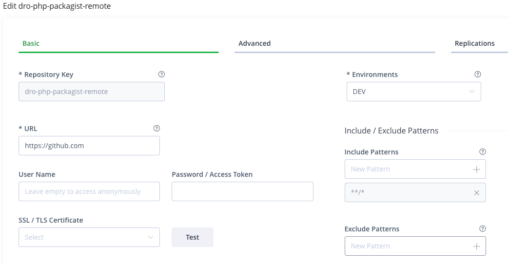
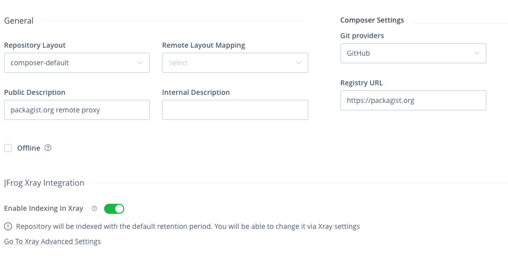
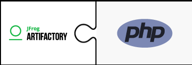
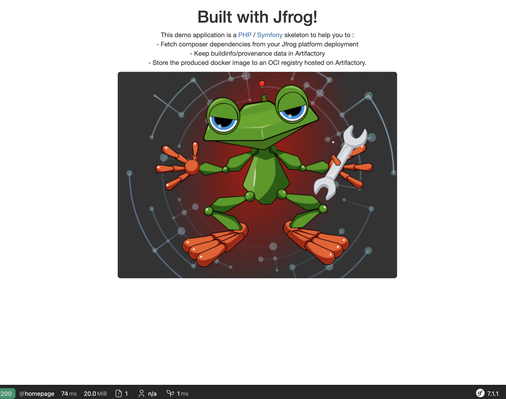

# Sample PHP / Symfony app using the JFrog platform for dependencies and binaries management

This demo application is a [PHP](https://www.php.net) / [Symfony](https://symfony.com) skeleton to help you to :
 * Fetch composer dependencies from your Jfrog platform deployment
 * Keep buildinfo/provenance data in Artifactory
 * Store the produced docker image to an OCI registry hosted on Artifactory.

This project will use Github Action for the build process.

## Installation

### Pre-requisites 

The following guide considers that you have [php](https://www.php.net), the [Symfony CLI](https://symfony.com/download) and [composer](https://getcomposer.org/) installed.
You must also have cloned this Git repository locally.

### Set up composer to use artifactory for dependencies resolution.

1 - Create a php composer remote repository on Artifactory :

Usually you'ill most likely wants to mirror packagist.org, and in this case, you can use the same settings as in the pictures below





Note that we have indexed this repository, to take advantage of Xray scanning capabilities.

In our case, for the rest of the instructions, the created php composer remote repository name is `dro-php-packagist-remote`.

2 - Configure composer to use this repository



In order to configure your Composer client to work with Aritfactory, you need to edit its config.json file (which can usually be found under <user-home-dir>/.composer/config.json) and add a repository reference to your Artifactory Composer repository. For example:

```javascript
{
    "repositories": [
        {   "type": "composer", 
            "url": "https://myjpd.jfrog.io/artifactory/api/composer/dro-php-packagist-remote"},
        {"packagist": false}
    ]
}

```
If you created the repository without anonymous access (recommended),
you will need to add artifactory credentials, in the auth.json file as follows:

```javascript
{
    "http-basic": {
        "myjpd.jfrog.io": {
            "username": "myusername",
            "password": "<PASSWORD>"
        }
    }
}
```
Optional step: if your Jfrog platform is not allowing HTTPS communication, you can configure composer to work with a non-secure URL (i.e. HTTP instead of HTTPS), you need to add the below configuration to the config.json file as well:

```javascript
"config": {
   "secure-http" : false
}
```

You should now be able to build the application with dependencies secured by Artifactory & Xray ! 

## Build & run the application

Simply run `composer install --prefer-dist` and `symfony serve` then you should be able to view the following homepage by going to http://localhost:8000

Here the application is running locally, using Symfony's default development server.

In the next step we will review how to ship this application to a container and publish it to Artifactory.

``` shell
docker build . my-app-php
```

``` shell
docker run -p 80:80 -p 443:443 -p 443:443/udp --tty my-php-app
```

Then go to https://localhost (accept the message about wrong certificates), and you should see the application home page, including the Symfony profiler toolbar


